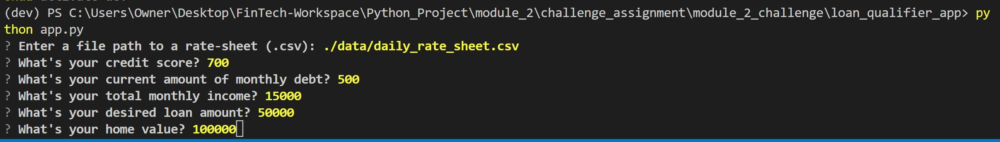

# Module_2_Challenge

This is a command-line interface application to match applicants with qualifying loans. The program was created to match loan applicants with specfic banks willing to underwrite the requested loan. 

---

## Latest Feature 

Granting the user the ability to save the results as a csv file.

---

## Technologies

This project leverages python 3.9 with the following packages:

* [fire](https://github.com/google/python-fire) - For the command line interface, help page, and entry-point.

* [questionary](https://github.com/tmbo/questionary) - For interactive user prompts and dialogs

---

## Installation Guide

Install the following dependencies prior to running the application:

```python
  pip install fire
  pip install questionary
```
---

## Usage

To use the qualifying loan application clone the repository and run the **app.py**:

```python
python app.py
```

Upon launching the application you will be greeted with the following prompts (the numbers entered are for demonstration purposes only).



---

---

## Contributors

Created by Maximus Accurso

---

## License

MIT

